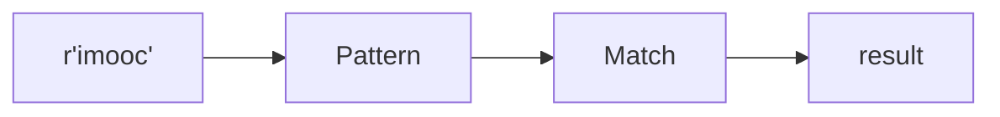

# Python 正则表达式

## 第1章 正则表达式介绍

### 1-1 正则简介

课程主要内容:

1. 正则表达式基本概念
2. python正则表达式re模块
3. 正则表达式语法
4. re模块相关方法使用

为什么使用正则

如果文本

场景1: 找到imooc开头的语句

那么我们使用

```python
def find_start_imooc(f_name):
    f = open(f_name)
    for line in f:
        if line.startswith('imooc'):
            print(line)
            
find_start_imooc('imooc.txt')
```

场景2: 找到imooc开头和结尾的语句

```python
def find_between_imooc(f_name):
    f = open(f_name)
    for line in f:
        if line.startswith('imooc') and line[:-1].endswith('imooc'):
            print(line)
            
find_between_imooc('imooc.txt')
```

场景3: 匹配一个下划线和字母开头的变量名

```python

```

我们的疑问:每一次匹配都要单独完成, 我们能否把它做成一个规则


正则表达式概念

1. 使用单个字符串来描述匹配一系列符合某个语法规则的字符串
2. 是对字符串操作的一种逻辑公式
3. 应用场景:处理文本和数据
4. 正则表达式过程: 依次拿出表达式和文本中的字符比较,如果每一个字符都能匹配,则匹配成功;否则匹配失败

## 第2章 正则表达式re模块

### 2-1 re模块使用(一)

1. `import re`: python正则表达式模块
2. 第一个正则表达式



`re.compile(r’imooc')` 生成一个Pattern对象

`pattern.match(‘imooc python’)`

## 第3章 正则表达式语法

### 3-3 python 正则表达式语法(三)

这一节课我们来学习如何使用正则表达式来进行边界匹配.我们所说的边界是指定匹配字符串的开头或者结尾. 正则表达式给我们提供了^和\$:

| 字符  |                匹配                 |
| :---: | :---------------------------------: |
|   ^   |           匹配字符串开头            |
|  \$   |           匹配字符串结尾            |
| \A/\Z | 指定的字符串匹配必须出现在开头/结尾 |

那我们怎样来理解字符串开头和结尾呢:

```python
>>> ma = re.match('[\w]{4,10}@163.com', 'imooc@163.com')
>>> ma.group()
'imooc@163.com'

# 把实际邮箱地址改成非法的
>>> ma = re.match('\w{4,10}@163.com', 'imooc@163.comabc') 
>>> ma.group()
'imooc@163.com'

# match方法是从开始进行匹配,一直匹配到不匹配的地方,所以ma.group的结果如上.但是这个结果并不是我们
# 所期望的,所以我们给正则表达式加上一个边界,让它以com结尾
>>> ma = re.match('\w{4,10}@163.com$', 'imooc@163.comabc')
>>> ma
# 没有匹配到任何结果

# 现在把abc去掉,并在开头加上^(但其实没什么用因为match默认就是从开头进行匹配)
>>> ma = re.match(r'^\w{4,10}@163.com', 'imooc@163.com')
>>> ma.group()
'imooc@163.com'
```

即我们可以用`^`和`$`进行全匹配.

```python
# 匹配一个imooc开头的字符串
>>> ma = re.match(r'\Aimooc\w*', 'imoocpython')
>>> ma.group()
'imoocpython'

# 修改匹配字符串为iimoocpython
>>> ma = re.match(r'\Aimooc\w*', 'iimoocpython')
>>> ma
# 没有结果,匹配不到字符串
```

正则表达式的分组匹配

|    字符     |               匹配                |
| :---------: | :-------------------------------: |
|     \|      |      匹配左右任意一个表达式       |
|    (a b)    |     括号中表达式作为一个分组      |
| \\\<number> | 引用编号为num的分组匹配到的字符串 |
| (?P\<name>) |          分组起一个别名           |
|  (?P=name)  |  引用别名为name的分组匹配字符串   |

`|`的示例:

```python
>>> ma = re.match(r'abc|d', 'abc')
>>> ma.group()
'abc'
>>> ma = re.match(r'abc|d', 'd')
>>> ma.group()
'd'

# 匹配一个0~100之间的数字组成的字符串
>>> ma = re.match(r'[1-9]?\d$', '9')
>>> ma.group()
'9'
>>> ma = re.match(r'[1-9]?\d$', '99')
>>> ma.group()
'99'
# 再匹配一个无效的
>>> ma = re.match(r'[1-9]?\d$', '09')
>>> ma
# 匹配不到
# 再匹配100
>>> ma = re.match(r'[1-9]?\d$', '100')
>>> ma
# 结果也是匹配不到
# 这个时候可以在表达式后面加一个|100
>>> ma = re.match(r'[1-9]?\d$|100', '100')
>>> ma.group()
'100'
# 这个时候可以匹配到100, 再尝试匹配99
>>> ma = re.match(r'[1-9]?\d$|100', '99')
>>> ma.group()
'99'
# 都是没有问题的
```

`(ab)`的示例:

```python
# 匹配163和126的邮箱:常规思路是在后面加一个或:|126.com,但这样不够优雅,可以把126提到前面,然后用小括号的# 方式
>>> ma = re.match(r'\w{4,6}@(163|126).com', 'imooc@163.com')
>>> ma.group()
'imooc@163.com'
>>> ma = re.match(r'\w{4,6}@(163|126).com', 'imooc@126.com')
>>> ma.group()
'imooc@126.com'
```

`\<number>`示例:

最常见的例子是判断XML语法的有效性, 比如要匹配`<book>python</book>`

```python
>>> ma = re.match()
```


### 4-1 Python正则表达式之re模块方法介绍

3. `sub(pattern, repl, string, count=0, flags=0)`: 将字符串匹配中匹配正则表达式的部分替换为其他值

叠1000-200店铺券 与 1000-250平台券 折上55折

店铺1000-120粉丝券


4. `split(pattern, string, maxsplit=0, flags=0)`: 根据匹配分割字符串,返回分割字符串组成的列表

`maxsplit`最大分割次数

### 4-2 Python正则表达式练习

练习:

抓取网页中的图片到本地

1. 抓取网页
2. 获取图片地址
3. 抓取图片内容并保存到本地


