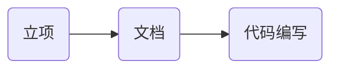

## 第1章 课程介绍

### 1-1 整体介绍

课程定位

帮助大家梳理知识点

讲述面试过程中的要点(技术和非技术)

面试官关注的侧重点

适合人群

* 已经是测试工程师
* 掌握Python基础

课程收获

* 经验丰富的测试人员可梳理知识体系
* 部分知识点你没有接触过可指明学习路线
* 非技术面试过程中可掌握面试侧重点

遇到课程中不包含的面试题怎么办?

其他服务


## 第2章 一线互联网公司的面试流程和技巧

### 2-1 岗位JD分析

测试工程师的岗位要求

岗位JD分析

分层自动化测试经验

瀑布流的布局: 是用时间滚轮,用滚动条来控制

隐藏元素, 

### 2-2 高级、资深测试工程师岗位技能树

开发语言: Python等

数据库: MySQL

操作系统: Linux

网络协议: 

测试技能: 自动化(UI、接口)、性能

业务技能:


### 2-3 测试架构师的能力要求

架构师与工程师等核心区别

* 架构的意义是什么?
  * 不同阶段用最小的代价解决不同问题的能力

### 2-4 测试人员的职业规划-分岔路的选择

初级-> 中级 -> 高级 -> 资深/经理 - > 架构/总监 - > CTO/VP

善于汇报么

未来半年要做什么


### 2-5 一面面试考察的重点

面试类型的分类

* 技术面试
* 项目面试
* 综合素质面试

一面-技术面试的考察重点

T字型人才

* 广博的技术面

目前在我们国内并不需要你技术创新, 虽然这些框架是基于, 你需要的只是学习和了解, 就是你会很多很多框架, 然后不管是数据库也好, 测试技术之类的. 剩下的对业务层面也吃的很透. 

* 专精的技术方向

就是我们列举的测试技术, 运维工程师. , 就要做到最专业, 你的专业, 包括和你合作过的所有合作伙伴. 把它做深、, 围绕一个一个技术项. 你的自动化是怎么做的. 你的性能测试是怎么做的, 那你测试过程中都遇到过什么问题吗? 这个问题, 问题回答浅了. 只有回答, 就是那些技术细节. 然后再着重, 那些你遇到的技术问题, 然后你有可能忽略的技术点.

完全都是技术.

### 2-6 二面面试考察的重点

核心考察点: 价值

* 为团队做了什么(质量/效率层面)
  * 你都为团队做了什么, 你们测试团队的, 有一部分公司, 测试团队, 我们在这里面做的时候, 你就要思考你为整个测试团队都做过什么, 质量层面, 另一方面是效率层面,
* 为项目做了什么
  * 项目提效的话并不是, 你的思维放在整个链路上, 项目好走, 你有没有推进项目周期的, 
* 为公司做了什么
  * 

这三项就是我总结出来的价值, 你作为一个, 你同工不同酬, 多多体现数字方面的东西

持续集成这个事比较好量化, 都是手工部署, 一个项目当中, 

第一是我做了什么, 然后是效率层面, 你跟别人有什么不同, 我为什么要录取你.

### 2-7 三面面试考察重点

能力

* 团队协作能力
* 团队管理能力
* 核心竞争力

### 2-8 面试的重点-精彩的自我介绍

* 深刻的第一印象
* 优秀的语言表达能力
* 亲和力

## 第3章 一面-Python高级编程和算法面试

### 3-1 Python 高级编程面试真题及考点分析

讲一些比较具有Python风格的, 跟别的语言写法不太一样的这些面试题.

1. 下面的代码打印结果是什么?

    ```python
    a = ('a', 'b', 'c')
    c = copy().copy(a)
    d = copy.deepcopy(a)
    if c == d:
        print("c和d值相等")
    if id(c) == id(d):
        print("c和d地址相等")
    ```
    
    考点:
    
    1. 深浅拷贝
    2. 可变对象和不可变对象
    
    这道题的变形: 第一行是一个小括号, 也可以换成中括号或大括号. 

2. 下面的代码的打印结果是什么

    ```python
    class Person:
        x = 5
        y = 6
        def __init__(self, x, y):
            self.x = x
            self.y = y    
        def add(self):
            return self.x + self.y

    person = Person(10, 20)
    person.z = 7
    print(person.x)
    print(person.y)
    print(Person.x)
    print(Person.y)
    print(Person.add(Person))
    print(person.add())
    print(person.z)
    print(Person.z)
    ```
    
    这道题的考点:
    
    1. 打印过程中是不是报错
    2. 类变量和实例变量的区别,调用方式是什么, 类Person中的x和y与构造函数中的`self.x`和`self.y`是一回事么
    
3. Python中一个函数function接收三个参数`a`, `*args`, `**kwargs`, 他们分别是什么类型

    考点:

    ​		可变参数类型, 关键字参数类型

4. 请根据列表`list1 = [1, 2, 3, 4, 5, 6]`, 使用一行代码生成一个新的列表`list2`, `list2`中每个元素是`list1`中的平方

   考点:

   ​		推导式

5. 请将下面列表进行排序`list1 = [20, 15, 88, 97, 76, 13, 27, 49]`

   考点: 

   ​		排序算法

6. 请实现: `@runtime` 效果为当调用`student_run`时会自动打印当前时间

    ```python
    @runtime
    def student_run(name):
        print("student" + name + "run")

    student_run("张三")
    ```
    
    考点: 注解, 也叫语法糖. 的实现原理.
    
7. 请简述func1和func2函数的返回值, 以及函数运行机制

    ```python
    def func1():
        for i in range(1, 5):
            return i

    def func2():
        for i in range(1, 5):
            yield i
    ```
    
    区别在于每个函数的返回值
    
    考点: `return`和`yield`的区别

### 3-2 Python面试题

1. Python中的多线程和多进程有什么区别?
2. Python中什么是可变数据类型, 什么是不可变数据类型
3. Python中如何实现单例设计模式
4. Python中一行代码如何实现两数交换
5. Python中的`__new_`和`__init__`两个方法有什么区别

### 3-3 对象的深浅拷贝面试题

```python

# 可变数据类型和不可变数据类型


b = a

# 浅拷贝
c = copy.copy(a)
# 
```

深

浅拷贝

在可变数据类型和不可变数据类型的表现

### 3-4 类变量、实例变量、类对象、实例对象的区别

创建`class_and_instance_var.py`

```python
class Person: # 类对象
    def __init__(self, x, y):
        self.x = x
        self.y = y
        print("x = " + str(x))
		print("y = " + str(y))
        
    def add(self):
        return self.x + self.y

# 实例对象
p = Person(1, 2)
p1 = Person(3, 4)

# 用类和实例进行方法的调用
print(Person.add())  # 产生一个报错: Error:add() missing 1 required positional argument: 'self'
print(p.add())

```

Person代表人类, 不断生产人. 生产出一个人叫p. 

用类来调用实例方法的时候:

```python
print(Person.add())
```

会报错:

```python
Error:add() missing 1 required positional argument: 'self'
```

在self的位置上传入Person:

```python
print(Person.add(Person))
```

会有新的报错:

```python
AttributeError: type object 'Person' has no attribute 'x'
```

所以还需要再传入两个参数:

```python
print(Person.add(Person(3, 4)))
```

这样就可以成功运行, 返回结果7.

传入的参数应该是一个实例对象.

#### 类变量和实例变量

```python
p.z = 7  # z叫做实例变量
print(p.z)
```

重新定义Person, 添加类变量

```python
class Person:
    x = 5
    y = 6
    
    def __init__(self, x, y):
        ...
```

在实例中调用x和y的值:

```python
p = Person(1, 2)
print(p.x)
print(p.y)
```

打印结果为1, 2, 说明他们都是实例变量.

```python
print(Person.x)
print(p.add())  # 3
```


### 3-5 可变参数类型

新建`part3/args.py`

```python
# a *args **kwargs

# 考点一: 可变参数、关键字参数是什么数据类型
def function(a, *args, **kwargs):
    print(type(a))
    print(type(args))
    print(type(kwargs))

# 调用这个函数
function(1, 1, 1)
# 打印结果为
# <class 'int'>
# <class 'tuple'>
# <class 'dict'>


# 考点二: 可变参数和关键字参数如何分配
# 重新调用function
function(6,7,8,9,b=2,c=3,d=4)

# 重写function
def function(a, *args, **kwargs):
    print(type(a))
    print(type(args))
    print(type(kwargs))
    print(a)
    print(args)
    print(kwargs)
# 打印结果为
# 6
# (7, 8, 9)
# {'b': 2, 'c': 3, 'd': 4}


# 第三个考点: 
function(6,7,b=2,c=3,d=4,8,9)
# 或者
def function(a, **kwargs, *args):
	...
# 代码都会提示错误
# 即调换调用函数中参数的顺序或者定义函数中的参数的位置, 都会报错
```


### 3-6 Python装饰器详解

在别的语言中也叫注解.

创建`part3/annotation.py`

```python
import time

def runtime(function):
  def get_now_time():
    	print(time.time())
      	function()  # 这里要回调一下function
  return get_now_time

@runtime
def run():
  	print("run")


run()
```

开发一个有参数的装饰器

```python
def runtime(function):
    def get_now_time(*args):
        print(time.time())
        function(*args)
    return get_now_time
        
@runtime       
def run(i):
    print(i)
    
run("hahaha")
```

开发一个关键字参数的装饰器:

```python
def runtime(function):
    def get_now_time(**kwargs):
        print(time.time())
        function(**kwargs)
    return get_now_time
        
@runtime       
def run(a):
    print(a)
    
run(a="hahaha")
```

开发一个传入混合参数的:

```python
def runtime(function):
    def get_now_time(name, **kwargs):
        print(time.time())
        function(name, **kwargs)
    return get_now_time
        
@runtime       
def run(name, **kwargs):
    print()
    
run("hehehe", a="hahaha")
```


### 3-7 return与yield的区别

本小节主要是来说一下, 

先说一个概念: 生成器.

新建`part3/return_and_yield.py`

```python
def func1():
    for i in range(1, 5):
        return i
    
def func2():
    for i in range(1, 5):
        yield i
        
print(func1())
print(func2())
# 打印结果为
# 1
# <generator object func2 at 0x10482efc0>
```

`return` 阻断了循环

再调用一下:

```python
yi = func2()
print(type(yi))
# 打印结果为
# <class 'generator'>
for i in yi:
    print(i)
```

`yield`并不阻断循环,而是把每个结果都返回


### 3-8 多种推导式的实现

之前出的那道面试题: 一行代码实现一个新的列表.这个里面要么考的是`lambda`表达式, 要么考的是推导式.

新建文件`part_3/comprehension.py`

```python
# 根据一个列表 创建一个新的列表. 用一行代码
# 有两种方式: lambda 表达式 推导式

# 首先来看用lambda表达式如何处理
list1 = [1, 2, 3, 4]
result = map(lambda x: x * x, list1)
print(list(result))
# 打印结果为[1, 4, 9, 16]
```

`lambda`表达式相当于一个匿名函数, 函数接受一个参数`x`, 运算结果是`x * x` 

`map`有两个参数, 第一个参数是接受一个函数, 另外一个是可迭代对象.查看`map`具体的源代码: 

```python
class map(object):
    """
    map(func, *iterables) --> map object
    
    Make an iterator that computes the function using arguments from
    each of the iterables. Stops when the shortest iterable is exhausted.
    """
    def __getattribute__(self, *args, **kwargs):
        """Return getattr(self, name)."""
        pass
    
    def __init__(self, func, *iterables):
        pass
    ...
```

可以看到构造函数中的参数是可迭代对象`*iterables`.

然后看一下用推导式来解决, 就是用列表推导式

```python
list2 = [i*i for i in liist1]
print(list2)
# 打印结果为[1, 4, 9, 16]
```

列表推导式相对来说更容易理解,更优雅一些.

在列表推导式中还可以进行有条件的筛选:

```python
list2 = [i*i for i in liist1 if i > 2]
print(list2)
# 打印结果为[9, 16]
```

1和4没有了因为进行了筛选.

还有集合推导式, 就是把列表推导式的中括号变成大括号:

```python
list1 = {1, 2, 3, 4}
list2 = {i*i for i in list1}
print(list2)
# 打印结果为{1, 4, 9, 16}
```

字典推导式:

```python
my_json = {
    "key1": 10,
    "key2": 20,
    "key3": 30
}

keys = [key for key, value in my_json.items()]
print(keys)
# 打印结果为['key1', 'key2', 'key3']

# 应用: 让key和value颠倒 (结果是一个字典)
keys1 = {value: key for key, value in my_json.items()}
print(keys1)
# 打印结果为{10: 'key1', 20: 'key2', 30: 'key3'}
```

也可以加一些筛选条件:

```python
keys2 = {key: value for key, value in my_json.items() if key == "key1"}
print(keys2)
# 打印结果为{‘key1': 10}
```


### 3-9 排序算法的复杂度解释

本小节说一下常见的排序算法:

新建`/part_3/sort.py`

```python
"""
常见的排序算法:
插入排序、希尔排序、直接排序、堆排序、
冒泡排序、快速排序、归并排序、基数排序
"""
```

一道阿里的面试题:

给定一个列表, 将这个列表进行排序, 要求: 时间复杂度要小于O(n^2)

复杂度:

1. 时间复杂度: 指算法在计算的过程中所需要的计算工作量
2. 空间复杂度: 指算法在计算的过程中所需要的内存空间

常见的时间复杂度:

常数阶:`O(1)`, 对数阶`O(log2n)`, 线性阶`O(n)`, 线性对数阶`O(nlog2n)`, 平方阶`O(n^2)`, 立方阶`O(n^3)`

随着问题的规模n不断增大, 上述的时间复杂度就不断增大, 意味着算法的执行效率越来越低.

回到阿里的那道面试题,时间复杂度要小于`O(n^2)`, 那就是要选平方阶前面的那些复杂度.

### 3-10 冒泡排序的时间复杂度及思想

冒泡排序的实现:

相邻的两个数字进行比较, 大的向下沉, 最后一个元素是最大的.

时间复杂度`O(n^2)`

```python
def bubble_sort(blist):
    # 首先要获取整个list的长度以控制循环的次数
    count = len(blist)
    for i in range(0, count):
        for j in range(i+1, count):
            if blist[i] > blist[j]:
                # 使用python特有的方法来进行两数交换
                blist[i], blist[j] = blist[j], blist[i]
    return blist

blist = bubble_sort([32, 12, 45, 64, 1, 5, 8])
print(blist)
# 打印结果为[1, 5, 8, 12, 32, 45, 64]
```


### 3-11 快排的时间复杂度及实现思想

快速排序的基本实现思路: 递归

列表中取出第一个元素,作为标准.把比第一个元素小的都放在左侧, 把比第一个元素大的都放在右侧

递归完成的时候就是排序结束的时候

快速排序的时间复杂度`O(nlog2n)`, 所以快排是符合阿里面试题的要求的

```python
def quick_sort(quick_list):
    if quick_list == []:
        return []
    else:
        first = quick_list[0]
        # 推导式实现
        less = quick_sort([l for l in quick_list[1:] if l < first])
        more = quick_sort([m for m in quick_list[1:] if m >= first])
        return less + [first] + more

blist = quick_sort([32, 12, 45, 64, 1, 5, 8, 10, 15, 99])
print(blist)
  	
c0 a8 1f 60 c0
```


## 第4章 一面-面向对象、函数式编程面试真题

### 4-1 面试真题及考点分析

#### 面向对象面试真题

1. 概述如何理解面向对象以及面向对象的特点

一般的同学看到这个题目的时候上来就回答面向对象的特点,然后就讲继承、封装和多态,然后就讲什么是封装什么是多态什么是继承.

这道题考的第一个问题是什么?我们来分析一下,如何理解面向对象,所以首先要讲一下怎么理解面向对象.然后再讲面向对象的特点.

那为什么要问你是怎么理解面向对象的呢,大家都知道面向对象是一种编程思想. 在程序设计的时候你能不能够把面向对象的这种程序设计理念应用好这个才是这道题真正想问的, 也就是你的编程思想掌握的有多深, 其实从这个问题侧面了解到你的代码量有多大.如果代码量写的少, 就这样的一个 开放式问题, 每个人回答的深度都不同.每个人的理解都不同.

2. 类中的私有变量是否能访问,如果能,那么如何访问?

这道面试题得看问什么样的语言, 因为我们课程都是讲的Python所以针对的就是Python语言, 考的考点就是你对Python语言底层的关于私有变量的封装是否了解, 你之前有没有注意到.

3. Python中的类有多少方法种类, 他们有什么区别?

这也是针对Python的类进行的一个考核.

考点是:是之前讲过的一个概念.类对象实例对象,里面还有一些方法:类方法、实例方法和静态方法.你对这三种方法到底有怎样的理解.

这里面可以拆分成两个问题 ,第一个问题是Python中的类有多少种方法,然后他们有什么区别. 也就是说这几个方法你在调用的时候或者说在面向对象这种编程思想的体现过程中,你具体是怎么应用的, 因为其实问类相关的东西,也都是你对面向对象整个这个思想的体现,什么时候应该用实例方法,什么时候应该用类方法, 又什么时候应该用静态方法.

整个来说都是对面向对象编程的思想的具体体现. 第一个问题是比较抽象的, 第三个问题是应用起来比较落地的,看你能不能具体吃透. 因为要是你概念上回答的很清楚但是具体方法上回答的不清晰, 那么他也会对你的编码能力产生质疑.

#### 函数式编程面试真题

1. 用函数实现过滤掉集合`list1 = [‘’, ‘hello’, None, ‘python’]`中的空格和空值

你用if判断也能实现. 使用过程也都是函数的使用过程, 也就是看你对Python那几个常用函数使用的是否熟练, 数据处理的时候就有可能用这个函数. 应用到这个函数的时候就要处理一下.假设说后台返回了值包含了一些空格, 或者我们很多人准备测试数据准备中有点疏漏写的不是很标准, 也可以用这种方式来去除. 再比如说前端输入用户名和密码. 两端的空格, 中间的空格就不用过滤掉.中间的一般是他故意输入的. 两遍比如填一些表单的时候, 当然我们自己在测表单的时候.

2. 用函数方法实现计算集合`list1 = [1, 2, 3, 4, 5]`中, 所有元素的和?

这个考的也是Python中一个函数的使用.

这两个都是非常具体的考点, 会就是会, 不会想也想不出来.

### 4-2 Python 中的私有变量能访问么

新建`part_4`包, 新建`private_var.py`

私有变量能访问么? 怎么就成私有变量了呢

```python
class Student:
  	__name = "三毛"
    school = "北大"
    
print(Student.school)
print(Student.__name)   # 报错: AttributeError: type object 'Student' has no attribute '__name'
print(dir(Student))
```

在Python中对私有变量如何封装的?

### 4-3 Python中类的方法种类及区别

新建`function_type.py`

```python
class Student:
  	name = "四毛"
  	
    def eat(self):	# 实例方法. 实例可以操作的方法, 可以操作实例变量
      	self.name = "三毛"
      	print("学生吃")
        print(self.name)
       
    @classmethod
    def study(cls):		# 类方法, 类可以直接调用, 可以操作类变量
      	print(cls.name + "student study")
        
    @staticmethod
    def run():			# 静态方法 脱离了类而存在的 跟类没有什么关系 写工具
      	print("student run")
        
    def __kaoshi(self):
      	print("学生考试")
        
        
    
Student.eat()   # 报错: TypeError: eat() missing 1 required positional argument: 'self'
s = Student()
print(dir(Student))
Student.study()  # 可以打印出 s tudent study
Student.run()


```

### 4-4 我对面向对象的理解

新建 `如何理解面向对象.txt`

一切皆对象, 万物皆对象

面向对象首先是一种编程思想

我的理解: 是编程世界向现实世界的一种延伸, 也就是万物皆可描述

我们用编程语言也可以描述世界万物.


类: 它就是面向对象的一种表现形式

大象放冰箱里分几步?

1. 打开冰箱
2. 装进大象
3. 关上冰箱

打开和关闭是冰箱的方法.

### 4-5 面向对象三大特性演示

新建包`/part_4/foo/`, 新建`animal.py`

```python
class Animal:
  	def run(self):
      	print("animal run")
        
    def eat(self):
      	print("animal eat")
        
    def talk(self):
      	print("animal talk")
        
a = Animal()
a.run()		# 打印出 animal run


class Person(Animal):   # 继承
  	def study(self):
      	print("person study")
        
    def talk(self):
      	print("person talk")
        
class Dog(Animal):
  	def talk(self):
      	print("dog talk")
        

p = Person()
print(p.eat())  # 打印 animal eat
p.talk()
d = Dog()
d.talk()
```


## 第5 章 一面-网络知识面试考点

### 5-1 网络面试真题及考点分析

1. 请说明session和cookie的作用和区别
2. HTTP协议如何保证数据在传输过程中不丢失

考点是: 网络协议分层, 包括三次握手, 四次挥手. 比如UDP 

1. 简要说明请求头中`Accept`\``Accept-Encoding``\``Accept-Language``都代表了什么意思

这几个字段是在请求头信息中, 我们都可能带一些请求头信息. 

它在初始验证的时候, 以作为身份标记. 

### 5-2 cookies和session 的存储和区别

什么是cookie

我们在访问一个Web应用程序的时候, 弹出开发者工具的框, 在那里可以看到cookie的存储情况.

然后key是什么, value是什么. 

前端要拿着这个cookie去访问后端, 它要拿着cookie里这些字段的值, session信息

第一个区别: 用户可见. 

session 一般在服务器上,存储到哪里都可以, 一般情况下存在数据库中, 比如Redis中, 或者文件中. 缺点是要自己维护session过期时间. 如果要存在redis中, redis有一个自己维护key的机制, 那你的应用程序, 所以存储到redis中有这样一个好处.

其实可以通过Web页面, 包括用户名密码来进行计算. 每个公司有不同的算法. Web再拿这个, 然后再访问这个Web, 它是这样的一个过程.

Cookie 与 session的区别

区别:

1. cookie 在客户端的头信息中
2. session 
3. 一般来说session的验证需要cookie带一个字段来表示这个用户是哪一个session, 所以当客户端禁用cookie时

#### Cookie 的总结

慕课网登录后的cookies.

cookie 就是一小段文本信息

cookie 的格式为key: vlaue; key: vaule

cookie 的值由服务端生成, 客户端保存

### 5-3 OSI网络协议分层详解

要记住中间各层是干什么的.

|            |                              |
| :--------: | :--------------------------: |
|   应用层   |      为应用程序提供服务      |
|   表示层   |    数据格式转化及加密操作    |
|   会话层   |     建立、管理和维护会话     |
|   传输层   | 建立、管理和维护端到端的连接 |
|   网络层   |       IP地址及路由选择       |
| 数据链路层 |    提供介质访问和链路管理    |
|   物理层   |      物理层, 即物理设备      |

#### OSI 七层协议与TCP/IP五层协议及对应网络协议


### 5-4 HTTP协议数据不丢失的网络机制

#### HTTP三次握手机制

客户端和服务端进行握手.

seq码, 主机b拿到syn=1, Seq=1

第二次握手: 服务端收到请求后发送, 要给你返回一个信息, 确认信息ACK=x+1, 

第一次握手和第二次握手,

第三次握手: 检查ACK number是不是正确, 

建立连接, 数据传输.

#### HTTP四次挥手机制

FIN是结束的标语, 告诉服务端,数据传输完了, 可以关闭

服务端接受到ack=u+1, seq=v, ack=1

第二次挥手的时候是半关闭状态

第三次挥手: 服务端发送给客户端: FIN=1, ack=u+1, seq=w, ack=1

第四次挥手: 客户端到服务端: ack=w+1, seq=u+1, ack=1

最后: 连接断开


### 5-5 HTTP协议信息头详解

#### 请求头

HTTP协议信息头

常用请求头:

`Accept`: 浏览器告诉服务器它所支持的数据类型

`Accept-Charset`: 浏览器告诉服务器它采用的字符集

`Accept-Encoding`: 浏览器告诉服务器它所支持的压缩格式

`Accept-Language`:

`Host`: 浏览器告诉服务器我想访问服务器哪台主机

`If-Modified-Since`: 浏览器告诉服务器它缓存数据时间是多少

`Referer`: 浏览器告诉服务器我是从哪个网页点过来的(防盗链)

`User-Agent`: 浏览器告诉服务器我所使用的浏览器类型、版本等信息 


## 第6 章 一面-Web自动化面试考点

### 6-1 Web自动化面试真题及技术点讲解

1. 你的自动化是如何落地的? 遇到了什么难点?
2. 遇到过哪些比较难定位的元素, 你是如何定位的

### 6-2 web自动化落地过程和难点剖析

首先我们在



落地过程中具体难点有哪些

* 前端代码改动大、频繁或不规范导致元素不好定位
* 自动化刚开始时,测试人员编码规范及架构设计不统一

### 6-3 下拉框定位

```python
from selenium import webdriver

option = webdriver.ChromeOptions()
option.add_argument('disable-infobars')

driver = webdriver.Chrome(chrome_options = option,
                          execute_path = )
driver.get("https://ww.")

driver.set_window_size(600, 800)

js = "window.scrollTo(0, 10000);"
driver.execute_script(js)


```

### 6-4 定位日期控件及js调试方法

6-5 页面弹出框的处理

6-6 浏览器自带弹出框定位

6-7 浏览器句柄切换

6-8 验证码解决思路

6-9 如何


