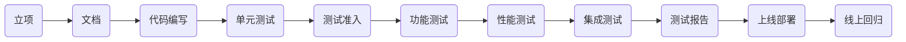
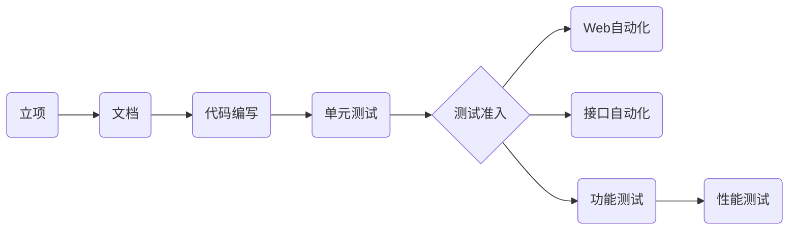

## 第1章 课程介绍

### 1-1 整体介绍

课程定位

帮助大家梳理知识点

讲述面试过程中的要点(技术和非技术)

面试官关注的侧重点

适合人群

* 已经是测试工程师
* 掌握Python基础

课程收获

* 经验丰富的测试人员可梳理知识体系
* 部分知识点你没有接触过可指明学习路线
* 非技术面试过程中可掌握面试侧重点

遇到课程中不包含的面试题怎么办?

其他服务


## 第2章 一线互联网公司的面试流程和技巧

### 2-1 岗位JD分析

测试工程师的岗位要求

岗位JD分析

分层自动化测试经验

瀑布流的布局: 是用时间滚轮,用滚动条来控制

隐藏元素, 

### 2-2 高级、资深测试工程师岗位技能树

开发语言: Python等

数据库: MySQL

操作系统: Linux

网络协议: 

测试技能: 自动化(UI、接口)、性能

业务技能:


### 2-3 测试架构师的能力要求

架构师与工程师等核心区别

* 架构的意义是什么?
  * 不同阶段用最小的代价解决不同问题的能力

### 2-4 测试人员的职业规划-分岔路的选择

初级-> 中级 -> 高级 -> 资深/经理 - > 架构/总监 - > CTO/VP

善于汇报么

未来半年要做什么


### 2-5 一面面试考察的重点

面试类型的分类

* 技术面试
* 项目面试
* 综合素质面试

一面-技术面试的考察重点

T字型人才

* 广博的技术面

目前在我们国内并不需要你技术创新, 虽然这些框架是基于, 你需要的只是学习和了解, 就是你会很多很多框架, 然后不管是数据库也好, 测试技术之类的. 剩下的对业务层面也吃的很透. 

* 专精的技术方向

就是我们列举的测试技术, 运维工程师. , 就要做到最专业, 你的专业, 包括和你合作过的所有合作伙伴. 把它做深、, 围绕一个一个技术项. 你的自动化是怎么做的. 你的性能测试是怎么做的, 那你测试过程中都遇到过什么问题吗? 这个问题, 问题回答浅了. 只有回答, 就是那些技术细节. 然后再着重, 那些你遇到的技术问题, 然后你有可能忽略的技术点.

完全都是技术.

### 2-6 二面面试考察的重点

核心考察点: 价值

* 为团队做了什么(质量/效率层面)
  * 你都为团队做了什么, 你们测试团队的, 有一部分公司, 测试团队, 我们在这里面做的时候, 你就要思考你为整个测试团队都做过什么, 质量层面, 另一方面是效率层面,
* 为项目做了什么
  * 项目提效的话并不是, 你的思维放在整个链路上, 项目好走, 你有没有推进项目周期的, 
* 为公司做了什么
  * 

这三项就是我总结出来的价值, 你作为一个, 你同工不同酬, 多多体现数字方面的东西

持续集成这个事比较好量化, 都是手工部署, 一个项目当中, 

第一是我做了什么, 然后是效率层面, 你跟别人有什么不同, 我为什么要录取你.

### 2-7 三面面试考察重点

能力

* 团队协作能力
* 团队管理能力
* 核心竞争力

### 2-8 面试的重点-精彩的自我介绍

* 深刻的第一印象
* 优秀的语言表达能力
* 亲和力

## 第3章 一面-Python高级编程和算法面试

### 3-1 Python 高级编程面试真题及考点分析

讲一些比较具有Python风格的, 跟别的语言写法不太一样的这些面试题.

1. 下面的代码打印结果是什么?

    ```python
    a = ('a', 'b', 'c')
    c = copy().copy(a)
    d = copy.deepcopy(a)
    if c == d:
        print("c和d值相等")
    if id(c) == id(d):
        print("c和d地址相等")
    ```
    
    考点:
    
    1. 深浅拷贝
    2. 可变对象和不可变对象
    
    这道题的变形: 第一行是一个小括号, 也可以换成中括号或大括号. 

2. 下面的代码的打印结果是什么

    ```python
    class Person:
        x = 5
        y = 6
        def __init__(self, x, y):
            self.x = x
            self.y = y    
        def add(self):
            return self.x + self.y

    person = Person(10, 20)
    person.z = 7
    print(person.x)
    print(person.y)
    print(Person.x)
    print(Person.y)
    print(Person.add(Person))
    print(person.add())
    print(person.z)
    print(Person.z)
    ```
    
    这道题的考点:
    
    1. 打印过程中是不是报错
    2. 类变量和实例变量的区别,调用方式是什么, 类Person中的x和y与构造函数中的`self.x`和`self.y`是一回事么
    
3. Python中一个函数function接收三个参数`a`, `*args`, `**kwargs`, 他们分别是什么类型

    考点:

    ​		可变参数类型, 关键字参数类型

4. 请根据列表`list1 = [1, 2, 3, 4, 5, 6]`, 使用一行代码生成一个新的列表`list2`, `list2`中每个元素是`list1`中的平方

   考点:

   ​		推导式

5. 请将下面列表进行排序`list1 = [20, 15, 88, 97, 76, 13, 27, 49]`

   考点: 

   ​		排序算法

6. 请实现: `@runtime` 效果为当调用`student_run`时会自动打印当前时间

    ```python
    @runtime
    def student_run(name):
        print("student" + name + "run")

    student_run("张三")
    ```
    
    考点: 注解, 也叫语法糖. 的实现原理.
    
7. 请简述func1和func2函数的返回值, 以及函数运行机制

    ```python
    def func1():
        for i in range(1, 5):
            return i

    def func2():
        for i in range(1, 5):
            yield i
    ```
    
    区别在于每个函数的返回值
    
    考点: `return`和`yield`的区别

### 3-2 Python面试题

1. Python中的多线程和多进程有什么区别?
2. Python中什么是可变数据类型, 什么是不可变数据类型
3. Python中如何实现单例设计模式
4. Python中一行代码如何实现两数交换
5. Python中的`__new_`和`__init__`两个方法有什么区别

### 3-3 对象的深浅拷贝面试题

```python

# 可变数据类型和不可变数据类型


b = a

# 浅拷贝
c = copy.copy(a)
# 
```

深

浅拷贝

在可变数据类型和不可变数据类型的表现

### 3-4 类变量、实例变量、类对象、实例对象的区别

创建`class_and_instance_var.py`

```python
class Person: # 类对象
    def __init__(self, x, y):
        self.x = x
        self.y = y
        print("x = " + str(x))
		print("y = " + str(y))
        
    def add(self):
        return self.x + self.y

# 实例对象
p = Person(1, 2)
p1 = Person(3, 4)

# 用类和实例进行方法的调用
print(Person.add())  # 产生一个报错: Error:add() missing 1 required positional argument: 'self'
print(p.add())

```

Person代表人类, 不断生产人. 生产出一个人叫p. 

用类来调用实例方法的时候:

```python
print(Person.add())
```

会报错:

```python
Error:add() missing 1 required positional argument: 'self'
```

在self的位置上传入Person:

```python
print(Person.add(Person))
```

会有新的报错:

```python
AttributeError: type object 'Person' has no attribute 'x'
```

所以还需要再传入两个参数:

```python
print(Person.add(Person(3, 4)))
```

这样就可以成功运行, 返回结果7.

传入的参数应该是一个实例对象.

#### 类变量和实例变量

```python
p.z = 7  # z叫做实例变量
print(p.z)
```

重新定义Person, 添加类变量

```python
class Person:
    x = 5
    y = 6
    
    def __init__(self, x, y):
        ...
```

在实例中调用x和y的值:

```python
p = Person(1, 2)
print(p.x)
print(p.y)
```

打印结果为1, 2, 说明他们都是实例变量.

```python
print(Person.x)
print(p.add())  # 3
```


### 3-5 可变参数类型

新建`part3/args.py`

```python
# a *args **kwargs

# 考点一: 可变参数、关键字参数是什么数据类型
def function(a, *args, **kwargs):
    print(type(a))
    print(type(args))
    print(type(kwargs))

# 调用这个函数
function(1, 1, 1)
# 打印结果为
# <class 'int'>
# <class 'tuple'>
# <class 'dict'>


# 考点二: 可变参数和关键字参数如何分配
# 重新调用function
function(6,7,8,9,b=2,c=3,d=4)

# 重写function
def function(a, *args, **kwargs):
    print(type(a))
    print(type(args))
    print(type(kwargs))
    print(a)
    print(args)
    print(kwargs)
# 打印结果为
# 6
# (7, 8, 9)
# {'b': 2, 'c': 3, 'd': 4}


# 第三个考点: 
function(6,7,b=2,c=3,d=4,8,9)
# 或者
def function(a, **kwargs, *args):
	...
# 代码都会提示错误
# 即调换调用函数中参数的顺序或者定义函数中的参数的位置, 都会报错
```


### 3-6 Python装饰器详解

在别的语言中也叫注解.

创建`part3/annotation.py`

```python
import time

def runtime(function):
  def get_now_time():
    	print(time.time())
      	function()  # 这里要回调一下function
  return get_now_time

@runtime
def run():
  	print("run")


run()
```

开发一个有参数的装饰器

```python
def runtime(function):
    def get_now_time(*args):
        print(time.time())
        function(*args)
    return get_now_time
        
@runtime       
def run(i):
    print(i)
    
run("hahaha")
```

开发一个关键字参数的装饰器:

```python
def runtime(function):
    def get_now_time(**kwargs):
        print(time.time())
        function(**kwargs)
    return get_now_time
        
@runtime       
def run(a):
    print(a)
    
run(a="hahaha")
```

开发一个传入混合参数的:

```python
def runtime(function):
    def get_now_time(name, **kwargs):
        print(time.time())
        function(name, **kwargs)
    return get_now_time
        
@runtime       
def run(name, **kwargs):
    print()
    
run("hehehe", a="hahaha")
```


### 3-7 return与yield的区别

本小节主要是来说一下, 

先说一个概念: 生成器.

新建`part3/return_and_yield.py`

```python
def func1():
    for i in range(1, 5):
        return i
    
def func2():
    for i in range(1, 5):
        yield i
        
print(func1())
print(func2())
# 打印结果为
# 1
# <generator object func2 at 0x10482efc0>
```

`return` 阻断了循环

再调用一下:

```python
yi = func2()
print(type(yi))
# 打印结果为
# <class 'generator'>
for i in yi:
    print(i)
```

`yield`并不阻断循环,而是把每个结果都返回


### 3-8 多种推导式的实现

之前出的那道面试题: 一行代码实现一个新的列表.这个里面要么考的是`lambda`表达式, 要么考的是推导式.

新建文件`part_3/comprehension.py`

```python
# 根据一个列表 创建一个新的列表. 用一行代码
# 有两种方式: lambda 表达式 推导式

# 首先来看用lambda表达式如何处理
list1 = [1, 2, 3, 4]
result = map(lambda x: x * x, list1)
print(list(result))
# 打印结果为[1, 4, 9, 16]
```

`lambda`表达式相当于一个匿名函数, 函数接受一个参数`x`, 运算结果是`x * x` 

`map`有两个参数, 第一个参数是接受一个函数, 另外一个是可迭代对象.查看`map`具体的源代码: 

```python
class map(object):
    """
    map(func, *iterables) --> map object
    
    Make an iterator that computes the function using arguments from
    each of the iterables. Stops when the shortest iterable is exhausted.
    """
    def __getattribute__(self, *args, **kwargs):
        """Return getattr(self, name)."""
        pass
    
    def __init__(self, func, *iterables):
        pass
    ...
```

可以看到构造函数中的参数是可迭代对象`*iterables`.

然后看一下用推导式来解决, 就是用列表推导式

```python
list2 = [i*i for i in liist1]
print(list2)
# 打印结果为[1, 4, 9, 16]
```

列表推导式相对来说更容易理解,更优雅一些.

在列表推导式中还可以进行有条件的筛选:

```python
list2 = [i*i for i in liist1 if i > 2]
print(list2)
# 打印结果为[9, 16]
```

1和4没有了因为进行了筛选.

还有集合推导式, 就是把列表推导式的中括号变成大括号:

```python
list1 = {1, 2, 3, 4}
list2 = {i*i for i in list1}
print(list2)
# 打印结果为{1, 4, 9, 16}
```

字典推导式:

```python
my_json = {
    "key1": 10,
    "key2": 20,
    "key3": 30
}

keys = [key for key, value in my_json.items()]
print(keys)
# 打印结果为['key1', 'key2', 'key3']

# 应用: 让key和value颠倒 (结果是一个字典)
keys1 = {value: key for key, value in my_json.items()}
print(keys1)
# 打印结果为{10: 'key1', 20: 'key2', 30: 'key3'}
```

也可以加一些筛选条件:

```python
keys2 = {key: value for key, value in my_json.items() if key == "key1"}
print(keys2)
# 打印结果为{‘key1': 10}
```


### 3-9 排序算法的复杂度解释

本小节说一下常见的排序算法:

新建`/part_3/sort.py`

```python
"""
常见的排序算法:
插入排序、希尔排序、直接排序、堆排序、
冒泡排序、快速排序、归并排序、基数排序
"""
```

一道阿里的面试题:

给定一个列表, 将这个列表进行排序, 要求: 时间复杂度要小于O(n^2)

复杂度:

1. 时间复杂度: 指算法在计算的过程中所需要的计算工作量
2. 空间复杂度: 指算法在计算的过程中所需要的内存空间

常见的时间复杂度:

常数阶:`O(1)`, 对数阶`O(log2n)`, 线性阶`O(n)`, 线性对数阶`O(nlog2n)`, 平方阶`O(n^2)`, 立方阶`O(n^3)`

随着问题的规模n不断增大, 上述的时间复杂度就不断增大, 意味着算法的执行效率越来越低.

回到阿里的那道面试题,时间复杂度要小于`O(n^2)`, 那就是要选平方阶前面的那些复杂度.

### 3-10 冒泡排序的时间复杂度及思想

冒泡排序的实现:

相邻的两个数字进行比较, 大的向下沉, 最后一个元素是最大的.

时间复杂度`O(n^2)`

```python
def bubble_sort(blist):
    # 首先要获取整个list的长度以控制循环的次数
    count = len(blist)
    for i in range(0, count):
        for j in range(i+1, count):
            if blist[i] > blist[j]:
                # 使用python特有的方法来进行两数交换
                blist[i], blist[j] = blist[j], blist[i]
    return blist

blist = bubble_sort([32, 12, 45, 64, 1, 5, 8])
print(blist)
# 打印结果为[1, 5, 8, 12, 32, 45, 64]
```


### 3-11 快排的时间复杂度及实现思想

快速排序的基本实现思路: 递归

列表中取出第一个元素,作为标准.把比第一个元素小的都放在左侧, 把比第一个元素大的都放在右侧

递归完成的时候就是排序结束的时候

快速排序的时间复杂度`O(nlog2n)`, 所以快排是符合阿里面试题的要求的

```python
def quick_sort(quick_list):
    if quick_list == []:
        return []
    else:
        first = quick_list[0]
        # 推导式实现
        less = quick_sort([l for l in quick_list[1:] if l < first])
        more = quick_sort([m for m in quick_list[1:] if m >= first])
        return less + [first] + more

blist = quick_sort([32, 12, 45, 64, 1, 5, 8, 10, 15, 99])
print(blist)
  	
c0 a8 1f 60 c0
```


## 第4章 一面-面向对象、函数式编程面试真题

### 4-1 面试真题及考点分析

#### 面向对象面试真题

1. 概述如何理解面向对象以及面向对象的特点

一般的同学看到这个题目的时候上来就回答面向对象的特点,然后就讲继承、封装和多态,然后就讲什么是封装什么是多态什么是继承.

这道题考的第一个问题是什么?我们来分析一下,如何理解面向对象,所以首先要讲一下怎么理解面向对象.然后再讲面向对象的特点.

那为什么要问你是怎么理解面向对象的呢,大家都知道面向对象是一种编程思想. 在程序设计的时候你能不能够把面向对象的这种程序设计理念应用好这个才是这道题真正想问的, 也就是你的编程思想掌握的有多深, 其实从这个问题侧面了解到你的代码量有多大.如果代码量写的少, 就这样的一个 开放式问题, 每个人回答的深度都不同.每个人的理解都不同.

2. 类中的私有变量是否能访问,如果能,那么如何访问?

这道面试题得看问什么样的语言, 因为我们课程都是讲的Python所以针对的就是Python语言, 考的考点就是你对Python语言底层的关于私有变量的封装是否了解, 你之前有没有注意到.

3. Python中的类有多少方法种类, 他们有什么区别?

这也是针对Python的类进行的一个考核.

考点是:是之前讲过的一个概念.类对象实例对象,里面还有一些方法:类方法、实例方法和静态方法.你对这三种方法到底有怎样的理解.

这里面可以拆分成两个问题 ,第一个问题是Python中的类有多少种方法,然后他们有什么区别. 也就是说这几个方法你在调用的时候或者说在面向对象这种编程思想的体现过程中,你具体是怎么应用的, 因为其实问类相关的东西,也都是你对面向对象整个这个思想的体现,什么时候应该用实例方法,什么时候应该用类方法, 又什么时候应该用静态方法.

整个来说都是对面向对象编程的思想的具体体现. 第一个问题是比较抽象的, 第三个问题是应用起来比较落地的,看你能不能具体吃透. 因为要是你概念上回答的很清楚但是具体方法上回答的不清晰, 那么他也会对你的编码能力产生质疑.

#### 函数式编程面试真题

1. 用函数实现过滤掉集合`list1 = [‘’, ‘hello’, None, ‘python’]`中的空格和空值

你用if判断也能实现. 使用过程也都是函数的使用过程, 也就是看你对Python那几个常用函数使用的是否熟练, 数据处理的时候就有可能用这个函数. 应用到这个函数的时候就要处理一下.假设说后台返回了值包含了一些空格, 或者我们很多人准备测试数据准备中有点疏漏写的不是很标准, 也可以用这种方式来去除. 再比如说前端输入用户名和密码. 两端的空格, 中间的空格就不用过滤掉.中间的一般是他故意输入的. 两遍比如填一些表单的时候, 当然我们自己在测表单的时候.

2. 用函数方法实现计算集合`list1 = [1, 2, 3, 4, 5]`中, 所有元素的和?

这个考的也是Python中一个函数的使用.

这两个都是非常具体的考点, 会就是会, 不会想也想不出来.

### 4-2 Python 中的私有变量能访问么

新建`part_4`包, 新建`private_var.py`

私有变量能访问么? 怎么就成私有变量了呢

```python
class Student:
  	__name = "三毛"
    school = "北大"
    
print(Student.school)
print(Student.__name)   # 报错: AttributeError: type object 'Student' has no attribute '__name'
print(dir(Student))
```

在Python中对私有变量如何封装的?

### 4-3 Python中类的方法种类及区别

新建`function_type.py`

```python
class Student:
  	name = "四毛"
  	
    def eat(self):	# 实例方法. 实例可以操作的方法, 可以操作实例变量
      	self.name = "三毛"
      	print("学生吃")
        print(self.name)
       
    @classmethod
    def study(cls):		# 类方法, 类可以直接调用, 可以操作类变量
      	print(cls.name + "student study")
        
    @staticmethod
    def run():			# 静态方法 脱离了类而存在的 跟类没有什么关系 写工具
      	print("student run")
        
    def __kaoshi(self):
      	print("学生考试")
        
        
    
Student.eat()   # 报错: TypeError: eat() missing 1 required positional argument: 'self'
s = Student()
print(dir(Student))
Student.study()  # 可以打印出 s tudent study
Student.run()


```

### 4-4 我对面向对象的理解

新建 `如何理解面向对象.txt`

一切皆对象, 万物皆对象

面向对象首先是一种编程思想

我的理解: 是编程世界向现实世界的一种延伸, 也就是万物皆可描述

我们用编程语言也可以描述世界万物.


类: 它就是面向对象的一种表现形式

大象放冰箱里分几步?

1. 打开冰箱
2. 装进大象
3. 关上冰箱

打开和关闭是冰箱的方法.

### 4-5 面向对象三大特性演示

新建包`/part_4/foo/`, 新建`animal.py`

```python
class Animal:
  	def run(self):
      	print("animal run")
        
    def eat(self):
      	print("animal eat")
        
    def talk(self):
      	print("animal talk")
        
a = Animal()
a.run()		# 打印出 animal run


class Person(Animal):   # 继承
  	def study(self):
      	print("person study")
        
    def talk(self):
      	print("person talk")
        
class Dog(Animal):
  	def talk(self):
      	print("dog talk")
        

p = Person()
print(p.eat())  # 打印 animal eat
p.talk()
d = Dog()
d.talk()
```


## 第5 章 一面-网络知识面试考点

### 5-1 网络面试真题及考点分析

1. 请说明 session 和 cookie 的作用和区别
2. HTTP 协议如何保证数据在传输过程中不丢失

考点是: 网络协议分层, 包括三次握手, 四次挥手. 比如 UDP 

1. 简要说明请求头中`Accept`\``Accept-Encoding``\``Accept-Language``都代表了什么意思

这几个字段是在请求头信息中, 我们都可能带一些请求头信息. 

它在初始验证的时候, 以作为身份标记. 

### 5-2 cookies 和 session 的存储和区别

本小节说一下 cookie 和 session 是怎么工作的,他们的机制是什么.

那么什么是 cookie? 首先来看一下 cookie 和 session 在应用程序中是如何工作的?


我们在访问一个应用程序的时候, Web 浏览器这种B/S 架构的首先打开一个浏览器,  这个时候按下F12弹出开发者工具的框, 在那里可以看到cookie的存储情况. 它是一系列key和value组成的字符串, 当我们第一次见到他们的时候并不知道他们代表什么意义, 除非一一地和后端开发工程师核对才能知道字符串是怎样生成的, 后端是如何验证的. 

但实际上cookies 是怎么来生成的呢? 其实cookie就是相当于「身份令牌」的一种东西, 前端要拿着这个「身份」去访问后端, 也就是要访问到服务器上(服务器可以理解为后端的代码, 后端代码有一部分业务逻辑在上面), 它要拿着cookie里边这么多的字段里边的值来进行验证, 后端验证完成后 session 信息就是在服务器上了. 这里就是他们

第一个区别: cookie是存储在客户端的, 存储在客户端意味着用户可见; 用户可见就说明那些有不法意图的人也能看见, 所以说cookie信息是可以伪造的. 为了保证安全机制, 我们应该还在服务端存一个东西, 让用户看不见, 这个就是session. session 其实是服务端生成的一个字符串.

那 session 信息一般在服务器上是怎么存储的呢?

其实存储到哪里都可以, 只要写在服务器上. 只是他们之间各有优缺点, 比如说我们常见的存储session的位置有: 一般情况下比较容易实现的是存储在数据库中, 像Redis中, 这里的「数据库」指的并不是MySQL, 当然你非要存在MySQL里也行. 比如说上面我列了一个「文件」, 存储到文件里和存储到MySQL数据库里道理是一样的, 缺点是要自己维护session过期时间. 比如说session会话要保持它的过期时间在10分钟, 那你就要自己计时, 到10分钟以后清除这个session. 如果要存到 Redis 数据库中, redis有一个自己维护key的机制, 存进去的时候就可以自动设置一个过期时间, 所以数据库里自动就维护了session里边一系列的「串」, 那你的应用程序只管往里写和往外拿,一个「写」一个「读」, 「读」不到了就意味着 session 过期了. 所以说存储到redis中有这样一个好处.

通过这样一个简要的图, 大家应该能明白「cookie 是存储在客户端的, session 是存储在服务端的」.

再说一下整个网络请求运转的流程: 最早的 cookie 信息其实也是服务器生成之后返回给Web的, 由服务端来生成的原因是: 首先因为服务端有自己的计算规则, 每当一个 Web 页面(或者理解为一个用户)来访问服务器的时候, 服务器必须要知道你是谁, 那么服务器怎样来计算呢: 其实可以通过Web页面传给它的一些信息来进行加密, 当然这些信息看我们怎么选择, 可以是用户名、密码, 包括一些头信息加到一块来进行计算. 当然每个公司或每个系统有不同的算法. 所以说你看到这个cookie的时候, 每次访问都不一样, 就是因为有一部分信息是变化的. 整个过程一开始是Web页面访问服务器, 服务器生成cookie返回给Web, Web存储, Web再拿这个cookie访问服务器, 服务器再验证这个cookie到底是不是合法的, 然后再返回给Web, 中间验证的过程就生成了session, 然后就存储起来了.它是这样的一个过程.

#### 区别

1. cookie 在客户端的头信息中

   ​	在头信息中会有一个cookie字段

2. session 在服务端存储, 文件、数据库等都可以

3. 一般来说session的验证需要cookie带一个字段来表示这个用户是哪一个session, 所以当客户端禁用cookie时, session 将失效.

#### Cookie 的总结

##### 慕课网登录后的cookies

```html
Cookie: imooc_uuid=43b08dd1-53e2-41b4-a8f2-d000d8b38efb; imooc_isnew_ct=1583568616; imooc_isnew=2; sensorsdata2015jssdkcross={"distinct_id":"2854754","first_id":"1721bf561dc3a4-0e088ef26f5c3e-30607700-2073600-1721bf561dd69e","props":{"$latest_traffic_source_type":"直接流量","$latest_search_keyword":"未取到值_直接打开","$latest_referrer":""},"$device_id":"1721bf561dc3a4-0e088ef26f5c3e-30607700-2073600-1721bf561dd69e"}; adv_#globalTopBanner_3181=1604426562045; adv_#globalTopBanner_3270=1604930701858; adv_#globalTopBanner_3376=1608223302094; adv_#globalTopBanner_3378=1608573273471; Hm_lvt_f0cfcccd7b1393990c78efdeebff3968=1609934514,1610884740; sensorsdata2015jssdkcross={"distinct_id":"2854754","first_id":"1721bf561dc3a4-0e088ef26f5c3e-30607700-2073600-1721bf561dd69e","props":{"$latest_traffic_source_type":"直接流量","$latest_search_keyword":"未取到值_直接打开","$latest_referrer":""},"$device_id":"1721bf561dc3a4-0e088ef26f5c3e-30607700-2073600-1721bf561dd69e"}; loginstate=1; apsid=VlMzIyOGQ0NDNjZDQ5YjQ2MWFiY2E5OTRmMjhkODQAAAAAAAAAAAAAAAAAAAAAAAAAAAAAAAAAAAAAAAAAAAAAAAAAAAAAAAAAAAAAAAAAAAAAAAAAAAAAAAAAAAAAMjg1NDc1NAAAAAAAAAAAAAAAAAAAAAAAAAAAAAAAAABncmVnb3J5c2hlbkAxNjMuY29tAAAAAAAAAAAAAAAAAGY1MmYwY2EzYjA4MmY1NjE2YWIxZTk1MjMzMDEyYTc1/EsQYN/5NF8=Nz; last_login_username=gregoryshen@163.com; Hm_lvt_c1c5f01e0fc4d75fd5cbb16f2e713d56=1611077418,1611927096; Hm_lpvt_f0cfcccd7b1393990c78efdeebff3968=1611931532; zg_did={"did": "170b40bf4e31ab-0072a681473031-396d7406-13c680-170b40bf4e4a4a"}; zg_f375fe2f71e542a4b890d9a620f9fb32={"sid": 1611931532447,"updated": 1611931532447,"info": 1611931532455,"superProperty": "{\"应用名称\": \"诸葛io\"}","platform": "{}","utm": "{}","referrerDomain": "coding.imooc.com","cuid": "lEhff_eIb8s,","zs": 0,"sc": 0,"firstScreen": 1611931532447}; IMCDNS=0; Hm_lpvt_c1c5f01e0fc4d75fd5cbb16f2e713d56=1612090998; cvde=60042684163f2-84
```

最前面有一个 `Cookie` 字段, 后面有一些key和value用等号来进行连接. 这么看根本不知道这些key和value代表什么, 当然他们有自己的计算规则, 要知道算法要跟开发沟通.

##### Cookie 的总结

* cookie 就是一小段文本信息

* cookie 的格式为key: value; key: value(每一个key对应一个value, 后端验证的时候也是首先拿到这个key进行匹配, 然后再计算value, )

* cookie 的值由服务端生成, 客户端保存

> 扩展: [前后端常见的几种鉴权方式](https://juejin.cn/post/6844903927100473357) 中 session-cookie 的部分
>
> 3.1 cookie
>
> http 协议是一个无状态协议, 服务器不会知道到底是哪一台浏览器访问了它, 因此需要一个标识来让服务器区分不同的浏览器. cookie 就是这个管理服务器与客户端之间状态的标识.
>
> cookie 的原理是, 浏览器第一次向服务器发送请求时, 服务器在 response 头部设置 Set-Cookie 字段, 浏览器收到响应就会设置 cookie 并存储, 在下一次该浏览器向服务器发送请求时, 就会在 request 头部自动带上 Cookie 字段, 服务器端收到该 cookie 用以区分不同的浏览器. 当然, 这个 cookie 与某个用户的对应关系应该在第一次访问时就存在服务器端, 这时就需要session了.
>
> 3.2 session
>
> session 是会话的意思, 浏览器第一次访问服务端, 服务端就会创建一次会话, 在会话中保存标识该浏览器的信息. 它与 cookie 的区别就是 session 是缓存在服务端的, cookie 则是缓存在客户端, 他们都由服务端生成, 为了弥补 http 协议无状态的缺陷.
>
> 3.3 session-cookie 认证
>
> 1. 服务器在接受客户端首次访问时在服务端创建session, 然后保存session(我们可以将session保存在内存中, 也可以保存在redis中, 推荐使用后者), 然后给这个session 生成一个唯一的标识字符串, 然后在响应头中种下这个唯一标识字符串.
> 2. 签名. 这一步通过密钥对sid进行签名处理, 避免客户端修改sid(非必需步骤)
> 3. 浏览器中收到请求响应的时候会解析响应头, 然后将sid保存在本地cookie中, 浏览器在下次http请求的请求头中会带上该域名下的cookie信息.
> 4. 服务器在接受客户端请求时会去解析请求头cookie中的id, 然后根据这个sid去找服务器端保存的该客户端的session, 然后判断该请求是否合法.
>
> 3.4 redis
>
> redis 是一个键值服务器, 可以专门放session的键值对.
>
> 3.5 用户登录认证
>
> 使用 session-cookie 做登录认证时, 登录时存储 session, 退出登录时删除session, 而其他的需要登录后才能操作的接口需要提前验证是否存在session, 存在才能跳转页面, 不存在则回到登录也main.

### 5-3 OSI网络协议分层详解

要记住中间各层是干什么的.

|            |                              |
| :--------: | :--------------------------: |
|   应用层   |      为应用程序提供服务      |
|   表示层   |    数据格式转化及加密操作    |
|   会话层   |     建立、管理和维护会话     |
|   传输层   | 建立、管理和维护端到端的连接 |
|   网络层   |       IP地址及路由选择       |
| 数据链路层 |    提供介质访问和链路管理    |
|   物理层   |      物理层, 即物理设备      |

#### OSI 七层协议与TCP/IP五层协议及对应网络协议


### 5-4 HTTP协议数据不丢失的网络机制

#### HTTP三次握手机制

客户端和服务端进行握手.

seq码, 主机b拿到syn=1, Seq=1

第二次握手: 服务端收到请求后发送, 要给你返回一个信息, 确认信息ACK=x+1, 

第一次握手和第二次握手,

第三次握手: 检查ACK number是不是正确, 

建立连接, 数据传输.

#### HTTP四次挥手机制

FIN是结束的标语, 告诉服务端,数据传输完了, 可以关闭

服务端接受到ack=u+1, seq=v, ack=1

第二次挥手的时候是半关闭状态

第三次挥手: 服务端发送给客户端: FIN=1, ack=u+1, seq=w, ack=1

第四次挥手: 客户端到服务端: ack=w+1, seq=u+1, ack=1

最后: 连接断开


### 5-5 HTTP协议信息头详解

#### 请求头

HTTP协议信息头

常用请求头:

`Accept`: 浏览器告诉服务器它所支持的数据类型

`Accept-Charset`: 浏览器告诉服务器它采用的字符集

`Accept-Encoding`: 浏览器告诉服务器它所支持的压缩格式

`Accept-Language`:

`Host`: 浏览器告诉服务器我想访问服务器哪台主机

`If-Modified-Since`: 浏览器告诉服务器它缓存数据时间是多少

`Referer`: 浏览器告诉服务器我是从哪个网页点过来的(防盗链)

`User-Agent`: 浏览器告诉服务器我所使用的浏览器类型、版本等信息 


## 第6 章 一面-Web自动化面试考点

### 6-1 Web自动化面试真题及技术点讲解

1. 你的自动化是如何落地的? 遇到了什么难点?

   可以把这个问题拆解成两个,第一点你要讲清楚你是怎么落地的, 第二点你要顺着你如何落地这个思路去讲你遇到了哪些难点. 如何落地的时候要说清楚整个项目流程是什么样的,怎么落地,你都是怎么做的,做了哪些工作,把这些事说清楚,然后再说清楚你在落地过程中遇到了什么问题并且解决了什么问题. 一定不能抛出问题,要把解决问题的思路展现出来, 这样你才能够凸显出你跟别人的不同, 凸显你的价值. 这个更偏向工作思路的分析, 你说你做过自动化测试,你是怎么做的, 一旦没有讲清楚你是不是没做过啊 

2. 遇到过哪些比较难定位的元素, 你是如何定位的

   你是如何定位的. 一个真正做过自动化的人, by_因为不可能通过都搞定, 一定有一些元素难定位. 不能说的非常平淡, 这个问题要讲一个深度. 然后再讲你是通过什么方式定位它. 证明自动化方向做的越深入. 这道问题就过去了但是实际上在面试官那留下的印象是不一样的.

3. 验证码的问题你是如何解决的?

   你是怎么解决验证码的, 凡是 Web 的都有验证码, 我们在做, 解决思路因为 Web 自动化这块, 真正让你写代码还是在基础语言那块, 自动化这块了解你对自动化做的深不深
   
4. 你的自动化框架是如何设计的?

   框架设计要针对做的过程中遇到的一些痛点, 然后来解决这个痛点, 这才是框架设计的根本出发点. 一个元素定位一个元素操作, 都往下走, 面临的问题就比较明显, 任务一旦出现分支操作, 前面的流程都要走一遍. 比如说登录, 如果你没有好的设计框架的思想, 每次跑的时候是不是有很多多余的步骤.

### 6-2 Web自动化落地过程和难点剖析

首先把我们整个的项目流程梳理了一下



比如项目是从头开始. 说经过立项, 有一些文档产出, 做代码编写, 然后做单元测试, 然后还有测试准入. 很多公司都没有测试准入, 开发人员提过来代码, 一提测刚测几个卡住了, 打回去,又改又测然后打回去, 这就是一定要建立一个准入的门槛, 这个门槛给到开发, 

准入测试, 也就是冒烟测试, 但是这个准入是一个更系统的测试, 之后, 功能测试之后, 产出一个测试报告, 然后我们会发布上线, 然后由运维的同学, 然后我们再做一个线上回归, 此时此刻

什么时候开始自动化才是最好的时间点呢?

* 测试准入

  为什么测试准入放在第一个点, 比如我们有一个测试门槛, 你再提测必须都测试通过了, 才能交给我测, 你把自动化的部分写好, 一旦他提测了, 提测之后部署到环境上, 或者搞持续集成, 把单个模块部署到服务器上, 自动化跑, 自动化没跑过就打回去, 让他重改, 然后再跑. 所以测试准入就是第一个切入点, 如果这里把关把的比较好,  

* 集成测试

  集成测试是另外一个比较重要的切入点. 集成测试做把我们所有的模块, 内部的外部的, 都可以叫集成, 先拿自动化跑一遍, 看一看, 如果大部分流程都OK了, 或者符合自动化场景的都OK了, 回头再做功能. 因为功能测试, 可以来一个循环的

* 线上回归

  线上回归也可以先用自动化跑一遍, 经过线下特别复杂, 用例特别多的, 简单自动化来回归一遍.

这里面, 你给你的面试官是不是可以把这三个点讲清楚, 你的价值最大化. 如果你在你具体的工作场景中,或者结合你具体的业务有更多的切入点的时候, 那也. 虽然我们很多个切入点. 很有可能是一套代码, 一套代码才证明你的自动化的代码写得好, 不要因为代码量的多与少对自己能力产生怀疑.

面试的时候可以多提一些数字, 可以让代码记录运行的次数, 将来它有可能是面试的资本. 

是不是讲出自己的这套自动化落地的价值,所以讲述自动化落地的时候, 最直观的就是数字, 直接给, 他就能非常好量化你的价值. 这是落地过程中非常重要的点.

第一个, 

第二个, 你的自动化所产生的效率的提高, 


#### 落地过程中具体难点有哪些

* 前端代码改动大、频繁或不规范导致元素不好定位

  尤其是刚开始做自动化的同学, 尤其是, 然后你搞一个元素,前端交互特别复杂, 我一开始做自动化的时候可能会出现这样的问题, 我怎么克服, 你是通过哪些方式来学习的, 这个问题是不是就引出, 你遇到哪些元素不太好定位是不是引出下面的面试题. 在面试的过程中你要尽量的去主导面试, 你要给面试官一个惯性思维, 比如说我遇到了元素不好定位的问题, 你都碰到了哪些元素不好定位啊, 引导方式的一种.你要给他一个问你的理由.

* 自动化刚开始时,测试人员编码规范及架构设计不统一

  一个人也不能说就一个人, 可能跟别人没有沟通不太好. 如果一个人的时候怎么说呢, 你要说你引领了什么,主导了什么, 把什么什么落地了. 这里说的是面试过程中一些难点. 这个问题引导了, 面试官会问你你是怎么解决这个问题的, 我主导自动化的测试架构, 然后做了哪些规范的事, 再让测试同学来让规范大家一起做, 整个做到架构统一, 编码也规范了, 比如说, 用什么工具做的规范, 用什么做代码管理. 架构分层, 你讲难点可以, 你把难点讲出来的时候要把下面的问题讲清楚, 你是怎么解决的.

### 6-3 下拉框定位

下拉框的定位方法:

新建 `scrool_bar.py` 滚动条是怎么定位的

```python
from selenium import webdriver

option = webdriver.ChromeOptions()
option.add_argument('disable-infobars')

driver = webdriver.Chrome(chrome_options=option,
                          execute_path="/path/to/chromedriver" )
driver.get("https://www.jd.com")

driver.set_window_size(600, 800)

js = "window.scrollTo(0, 10000);" # 第一个参数是横向的参数, 第二个参数是纵向的, 10000代表最下/右
driver.execute_script(js)
```


### 6-4 定位日期控件及js调试方法

时间控件如何定位

出发日期是一个 input 输入框, 有一个 readonly 属性,  提供一个思路 js, 在selenium 是可以运行 js 脚本的. 

```python
driver.get("https://www.12306.cn/index/")


train_date = 

js = "document.getElementById('train_date').removeAttribute('readonly')"
driver.execute_script(js)

driver.find_element_by_id("train_date").clear()
driver.find_element_by_id("train_date").send_keys("2018-12-12")
```

调试js的小技巧:

在console中: `document.getElementById('train_date')`

### 6-5 页面弹出框的处理


### 6-6 浏览器自带弹出框定位


### 6-7 浏览器句柄切换


### 6-8 验证码解决思路


### 6-9 如何保证元素定位的成功率


### 6-10 框架设计PO模式BasePage封装


### 6-11 框架设计PO完整封装


### 6-12 PO模式总结


### 6-13 UI自动化必问面试题


## 第7章 一面-接口自动化与持续集成面试考点

### 7-1 接口自动化落地过程详解




### 7-2 接口测试和持续集成面试考点

> 你的接口自动化是如何做的?

取得了怎样的收益, 接口自动化和web自动化, 落地难点, 代码的一个方面, 接口自动化参数的传递比Web自动化更稳定. 

> 你常用的接口请求方式及区别?

数据和方式. 

> 你的持续集成是怎么做的?


> 你是如何理解持续集成的?


### 7-3 接口自动化落地难点及回答的核心思想

我在落地过程中碰到了哪些问题, 我是如何解决的. 所有的问题要围绕着你的价值来讲.

* 接口文档的管理(创建与维护)

  属于你的推动能力的体现

* 多测试人员协同开发时多case维护

  很少有一个中央管理器, 具体测试环境的数据库, 这个case是共享.

核心价值点, 也要提现价值和

### 7-4 接口自动化常见面试题

> 常用的接口自动化数据传递方式及区别

get和post

区别: 两个角度来回答数据格式和数据传递位置  key-value 格式

> 接口测试中常用的库

requests和urllib库

### 7-5 持续集成落地过程及面试重点

持续集成: 就是把所有的模块自动化部署到

测试准入 

内部集成: 

## 第8章 一面-性能测试进阶面试考点-java性能调优

### 8-1 jvm性能测试面试题考查点

jvm面试真题及技术点考察

> 什么是内存溢出? 为什么会内存溢出?

> JVM 的内存区域是如何划分的

> JVM 是如何进行垃圾回收的

### 8-2 图解jvm内存区域划分

### 8-3 理解jvm中垃圾回收的原因

### 8-4 jvm垃圾收集算法

### 8-5 补充操作文档的说明

### 第9章 一面- MySQL数据库使用及数据库性能调优面试考点

### 9-1 面试真题及技术点分析

在这里拿出几道经常问别人的面试题:

> MySQL 中索引什么作用?

索引不是很简单么, 重点是为了查询速度变快, 有很多很多的技术点, 索引分, 在不同的存储引擎. 会以一条主线来.


> 如何分析一条查询 SQL 的效率?

在有一个关键字有一个执行计划, 但是它就可以分析出mysql的效率. 

> MySQL 的常用存储引擎有什么? 区别是什么?

innodb, MyISam. 这一道题也可以结合. 它的, 并且索引是如何工作的.

### 9-2 索引在不同引擎中的存储形式

MySQL 中索引是什么作用?

单独来说, 索引底层还隐藏了很多很多技术点.

什么是索引

索引的定义和创建的目的

索引是对数据库表中<u>一列或多列</u>的值进行排序的一种结构, 使用索引可**快速访问**数据库表中的特定信息.

索引的分类?

主键索引, 

区别和创建的方式

创建索引的目的就是加快检索表中数据的速度, 也就是查询数据的速度.

> 索引是越多越好么?

不是, 索引过多的创建, 会带来数据的写入的代价过高, 即减慢数据写入速度.

索引过多的创建为什么会影响写入速度

MyISAM引擎:

数据存储分为三个文件:

* Table.frm 存储表定义
* Table.MYD 存储表数据
* Table.MYI 存储表索引

InnoDB 引擎:

存储方式:

* 共享表空间
  * 一个表中数据可以横跨多个文件: 文件1 文件2 文件3…文件n
* 单独表空间
  * 文件1, 也是表1的数据
  * 文件2, 也是表2的数据
  * 文件n, 也是表n的数据

数据存储到 /var/lib/mysql

进入到mysql中, 

```shell
ls -alh tables*


ls -alh server*
```


### 9-3 不同引擎下索引是如何工作的

MyISAM 引擎

InnoDB 引擎

为什么MyISAM 的查询引擎比 InnoDB 的快?


### 9-4 MySQL常用引擎的特点和区别

#### MyISAM 引擎的特点

1. 在进行数据的备份、迁移、恢复等操作时, 非常容易. 只要对文件进行操作就可以.
2. MyISAM 只支持表锁, 没有行锁
3. MyISAM 不支持事务安全, 但每次读的操作是具有原子性的, 所以不必担心脏读等情况[^1] 

#### InnoDB 引擎的特点

1. 支持事务、回滚、崩溃修复, 所以对数据安全性较高的业务场景都选择了这个引擎
2. 支持行级锁, 行级锁的支持大大提高了数据库的并发操作能力.
3. 支持外键约束, 在MySQL中, 只有InnoDB支持外键, 在<u>范式设计</u>[^2]的原则下, 外键约束保证了数据的完整性.

操作几十个G的数据, 

### 9-5 SQL语句效率分析

如何进行 SQL 优化

执行计划: explain 

用法: explain <SQL 语句>

## 第10章 一面- Linux操作系统基本操作及系统性能监控面试考点


### 10-1 Linux操作命令面试真题及讲解

> 如何动态查看文件中你关心的内容, 比如error信息

tail -f {文件名称} | grep “关键字”

> 如何跨服务器拷贝你的文件?

scp

> 超大文件在跨服务器拷贝过程中, 经常断开, 你怎么解决的?

rsync 断点续传

> 文件查看常用命令有什么? 请讲述他们的区别?

tail, more, less, cat

> 如何去除文件中的重复行

cat data | sort | uniq

如果想要改文件内容

cat data | sort | uniq > data1

> 如何通过监控命令查看服务器的平均负载值

### 10-2 Linux 监控命令说明

`top` 命令

load average: 5分钟, 10分钟, 15分钟

`free` 命令

`vmstat` 命令

`iostat` 命令


## 第11章 二面-项目面试的核心考察点

### 11-1 项目面试真题

二面最重要的点就是突出自己的价值.

1. 你是如何保证项目质量的?

   项目质量最终决定了项目上线的时候 bug 的多与少, 这道题问的核心点在于: 项目的时间、人员、流程都是固定的, 在这些固定的流程里面我们应该做出哪些事情来保证项目质量,因为我们不能要求别人怎么做, 我们自己怎么做就是一个非常重要的考核因素. 考察的就是面试者如何在很多条件都不可控的情况下自己多做什么事情来保证最终的项目质量, 保证我们的软件有质有量的进行上线. 看看面试者能不能在项目里面主动去思考这些事情, 并主动去做这些事情.

2. 你是如何推进项目进度的?

   在实际的项目过程中大家都会面临一个问题: 眼看着马上上线了, 然后没有测试时间了. 如何能够按照最早既定的时间保证上线. 其实如果说是你遇到了刚才那种情况, 比如说明天上线今天才提测, 那你做什么都晚了. 这里的核心点在于预防, 你不要让所有的事情都堆积到后面,也不要让开发人员在开发项目的过程中你什么都不做只是等待他真正提交测试的时候才来做这些事. 这个时候就要看你在项目里面推进能力. 提前我们可以做一些什么事去保证我们后面的工作变得很顺利, 还有就是要是提前做了这些事,后面的测试就会变得很顺利, 不要等着项目真正提交到你手上了再去了解各种各样的事, 浪费很多很多时间.

3. 推进项目的过程中遇到了哪些问题

   既然上面讲述了推进项目里面表现出来我们对工作的积极性和热情, 那做这件事必然会引来一系列的问题, 这个问题我们是怎么解决的, 都遇到了哪些问题. 假设说即便没遇到问题, 你得说两个体现你价值的问题, 再说一下你是怎么推进的, 怎么解决的.

二面掌握住这些核心点, 能够比较突出你在整个项目里的价值.

### 11-2 你是如何保证项目质量的

回顾一下项目的流程

然后再进行单元测试. 保证项目的质量一定要从源头开始抓起. 立项的阶段开始写文档. 如果人家代码都写完了 保证项目质量的第一步就是要尽早了解项目的需求. 在开发人员编写代码的过程中可以写一些测试代码. 保证掌握的需求是第一手的不是很多人. 代码能力如何增强, 无非就就是学习. 

测试准入. 所有的测试人员会把测试都做好. 当开发人员把项目部署好之后开发就会调起 然后跑一下. 如果通不过. 保证开发人员提交过来的 而不是有可能跑都跑不通的项目. 如果有可能, 在自己的项目中测试准入. 放到持续集成的环境中.

测试准入跑完了以后, 就开始内部集成. 可以跑一下 Web 自动化, 接口自动化, 性能基准测试. 内部集成的代码. 尽量在开发人员. Web 自动化有一定难度, 如果前端人员没有写好. 但是接口自动化代码一定要提前写. 你可以提前 mock 一个环境. 就是刚才提到的立项在文档之初. 在架构设计

### 11-3 你是如何推进项目进度的

如果因为测试人员的, 我们如何去避免这些情况呢. 一般

第一件事是站会, 我开过高效的站会, 当然不一定是站会这种形式, 有一种手段或方法开发或测试他们的工作进度, 这样你就了解到整个项目的的进度, 

站会之后是在项目里面要分模块进行自动化测试. 每个模块是散开的, 当所有模块, 如果把测试再进行测试, 第一是bug的排查不好找, 导致. 首先其中一个开发人员就, 点对点的沟通, 发现 bug 了, 直接 提高测试效率. 只是当时, 如果再改起来也有问题, 

持续集成, 节省了项目部署的时间, 降低集成测试成本. 然后都改掉了, 持续集成它是包含运维、开发测试都包括在内的, 把它做好可以让, 避免一些不必要的时间浪费. 

多沟通, 你是提前知道或 你有可能做出相应的一些反应, 这样不好, 也不是. 第二个就是产品经理, 在一定程度上有需求的设计权, 你跟他多沟通就. 第三个就是跟项目经理多沟通. 项目经理主要推动项目进度. 你要, 先做到, 总有人去沟通, 沟通带来的另外的好处是提前评估意外的需求变更带来的风险. 一旦在, 同时给出一个解决方案是最好的, 你要让她评估, 以上就是对如何推进项目进度的见解

### 11-4 项目中遇到了哪些问题

一定不要说: 吐槽, 别人做的这不好那不好. 那应该说哪些?

分为内部问题和外部问题: 

内部问题: 

无自动化, 测试效率低: 发现项目, 要提高, 推进自动化的测试能力, 再往下讲具体是怎么做的. 

有自动化用例但维护不及时: 读取Excel里的数据然后,

​	推进用例以原始数据的形式存储在数据库中

​		每个人都要, 这些数据就共享了, 这些, 真正解决问题, 工作中别人干啥我干啥, 我发现问题, 最后一个阶段是我不仅可以, 真正去解决这个问题, 我都能达到. 这个也


### 11-5 为项目做了哪些贡献


## 第12章 三面-综合素质面试

### 12-1 综合素质面试的核心考查点

三面为什么有时候挂的莫名其妙?

#### 综合素质面试核心点剖析

* 性格

* 稳定性

  我要看你过去的一些工作经历, 是否是足够的时间长, 前两年, 员工的稳定性拿到台面上了. 这是任何一个公司

* 沟通能力

  其实也是一种语言表达能力, 随便聊一聊的过程中, 技术立足, 项目中沟通能力

* 团队协作能力

  在团队中你是什么样的角色, 

* 管理能力(个人及团队)

  个人管理能力属于你有没有良好的习惯, 一种是工作上的习惯: 有没有明确的计划, 每一步应该做什么, 生活中的管理能力, 

  团队管理能力也是一种协调能力. 如果他们愿意配合你, 这种管理能力就是非常不错的. 下面有一些人资历比你老.

* 目标感与责任感

  看似责任感很虚, 但是责任感又无所不在. 如果是一家中小型公司, 

  目标感就是你对未来是否有规划. 

人人都希望有这样一个员工, 你是否

#### 三面综合素质面试面试真题

* 业务能力(特定行业的业务知识)

* 团队中有人不服你怎么办?(管理岗必备)

* 未来的职业规划是什么?

  对自己是否有一个很好的管理能力

* 你认为你能够胜任这个工作的原因是什么?

  将自己的优点是什么, 跟这个岗位的匹配度是什么

* 为什么要离职

  一定要讲一个让人信服

* 团队中有工作需要加班, 你会如何处理

### 12-2 解决人际关系

#### 团队中有人不服你怎么办

首先分析一下对方, 一种是男人. 女人. 请她帮忙. 


### 12-3 职业规划问题核心点

#### 未来的职业规划是什么

##### 无休止的技术之路

要尽量和工作挂上钩, 要把自己锁一些

##### 尽自己最大的努力为团队、为公司的效能共享力量


### 12-4 为什么能够胜任这份工作

能够胜任这份工作的原因是什么

个人优势

* 持续的学习能力 -  丰富知识体系可为公司做更大的共享
* 乐观的态度 - 遇到困难优先去想解决办法, 而不是逃避
* 对工作的热情 - 在工作中能够找到自信与成就感

### 12-5 离职原因不可触碰的雷区

不可触碰的雷区

* 吐槽加班
* 吐槽公司和老板
* 吐槽团队
* 吐槽制度

### 12-6 聊聊加班的问题

* 首先表明态度

  我不介意加班, 

* 思考解决办法

  常态加班, 公司, 因为每个公司背后都有它自己的原因, 作为面试者,

* 提高工作效率

  哪些工作是重复劳动, 让它都自动化的处理. 项目组加班的情况

### 12-7 个人经典问题与总结

#### 你自己有什么缺点

##### 只讲技术方面, 比如知识的深度还不够, 源码阅读的比较少

##### 切记不要讲性格方面的缺点

#### 结婚&生子

##### 核心: 短时间内没有计划

#### 业余时间有什么爱好

##### 一定要是积极向上的爱好

##### 对新技术的探索

##### 同事聚会, 加强默契与了解

#### 再次总结三面的核心关键词

乐观

好学

积极

有责任

随和

风险

## 第13章 课程总结

### 13-1 课程总结

#### 面试核心流程回顾

一面: 技术

二面: 项目

三面: 综合素质

#### 职业技能树深入方向

#### 简历的核心点

##### 价值

##### 数字

除非你很好看, 否则不要轻易贴照片


