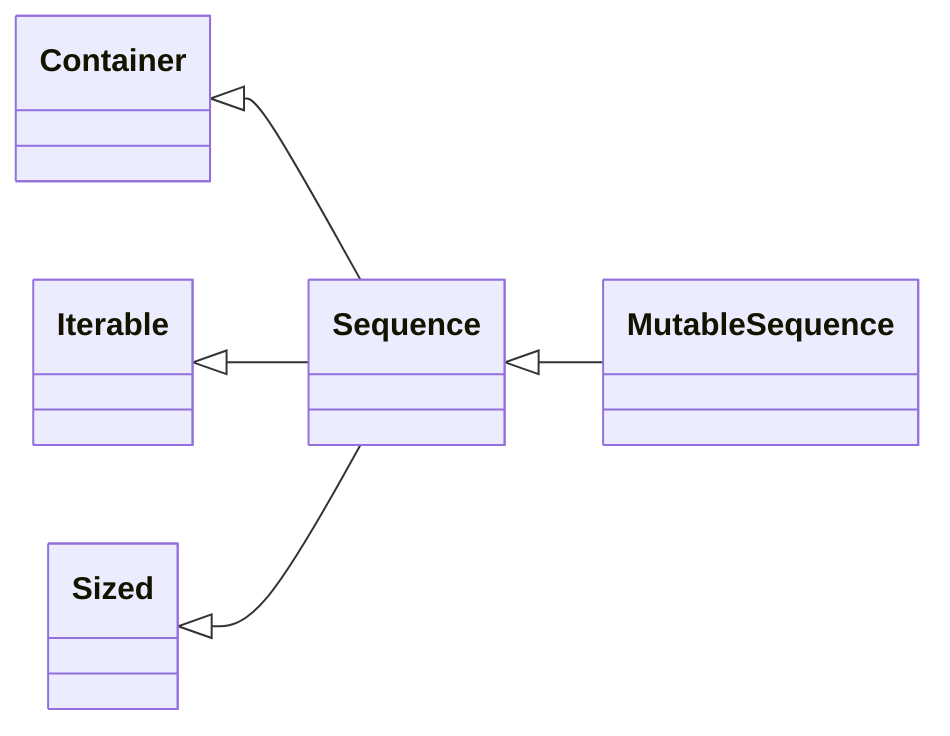

## Chapter 2. An array of Sequences

> As you may have noticed, several of the operations mentioned work equally for texts, lists and tables. Texts, lists and tables together are called *trains*. […] The FOR command also works generically[^2-0-1] on trains.
>
> ​																										  – Geurts, Meertens, and Pemberton
>
> ​																												   ABC Programmer’s Handbook

Before creating Python, Guido was a contributor to the ABC language – a 10-year research project to design a programming environment for beginners. ABC introduced many ideas we now consider “Pythonic”: generic operations on sequences, built-in tuple and mapping types, structure by indentation, strong typing without variable declarations, and more. It’s no accident that Python is so user-friendly.

Python inheirted from ABC the uniform handling of sequences. Strings, lists, byte sequences, arrays, XML elements, and database results share a rich set of common operations including iteration, slicing, sorting, and concatenation.

Understanding the variety of sequences available in Python saves us from reinventing the wheel, and their common interface inspires use to create APIs that properly support and leverage existing and future sequence types.

Most of the discussion in this chapter applies to sequences in general, from the familiar `list` to the `str` and `bytes` types that are new in Python 3. Specific topics on lists, tuples, arrays, and queues are also covered here, but the focus on Unicode strings and byte sequences is deferred to Chapter 4. Also, the idea here is to cover sequence types that are ready to use. Creating your own sequence types is the subject of Chapter 10.

### 2-1 Overview of Built-In sequences

The standard library offers a rich selection of sequence types implemented in C:

*Container sequences*

​		`list`, `tuple`, and `collections.deque` can hold items of different types.

*Flat sequences*

​		`str`, `bytes`, `bytearray`, `memoryview`, and `array.array` hold items of one type.

Container sequences hold references to the objects they contain, which may be of any type, while flat sequence physically store the value of each item within its own memory space, and not as distinct objects. Thus, flat sequences are more compact, but they are limited to holding primitive values like characters, bytes, and numbers.

Another way of grouping sequence types is by mutability:

*Mutable sequences*

​		`list`, `bytearray`, `array.array`, `collections.deque`, and `memoryview`

*Immutable sequences*

​		`tuple`, `str`, and `bytes`

Figure 2-1 helps visualize how mutable sequences differ from immutable ones, while also inheriting several methods from them. Note that the built-in concrete sequence types do not actually subclass the Sequence and MutableSequence abstract base classes (ABCs) depicted, but the ABCs are still useful as formalization of what functionality to expect from a full-featured sequence type.

Keeping in mind these common traits – mutable versus immutable; container versus flat – is helpful to extrapolate[^2-1-1] what you know about one sequence type to others.

The most fundamental sequence type is the list – mutable and mixed-type. I am sure you are comfortable handling them, so we’ll jump right into list comprehensions, a powerful way of building lists that is somewhat underused because the syntax may be unfamiliar. Mastering list comprehensions opens the door to generator expressions, which – among other uses – can produce elements to fill up sequences of any type. Both are the subject of the next section.

### 2-2 List Comprehensions and Generator Expressions

A quick way to build a sequence is using a list comprehension (if the target is a list) or a generator expression (for all other kinds of sequences). If you are not using these syntactic forms on a daily basis, I bet you are missing opportunities to write code that is more readable and often faster at the same time.

If you doubt my claim that these contracts are “more readable”, read on. I’ll try to convince you.

> For brevity, many Python programmers refer to list comprehensions as listcomps, and generator expressions as genesis, I will use these words as well.

#### List Comprehensions and Readability

### 2-3 Tuples Are not Just Immutable Lists

### 2-4 Slicing

### 2-5 Using + and * with Sequences

### 2-6 Augmented Assignment with Sequences

### 2-7 list.sort and the sorted Built-In Function

### 2-8 Managing Ordered Sequences with bisect

### 2-9 When a List Is Not the Answer

### 2-10 Chapter Summary

### 2-11 Further Readings

[^2-0-1]:relating to a whole group of things rather than to one thing
[^2-1-1]: /ɪkˈstræpəleɪt/ v.（由已知资料对未知事实或价值）推算，推断 to use facts about the present or about one thing or group to make a guess about the future or about other things or groups

